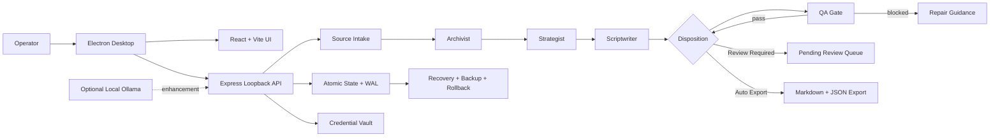
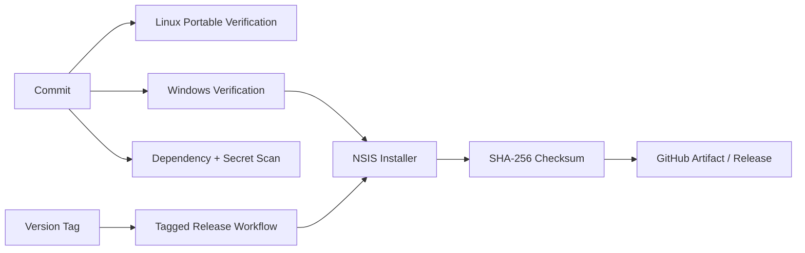

# WAKE Engine V6 — Architecture and Trust Boundaries

## System purpose

WAKE Engine is a local-first Windows desktop workbench for transforming operator-approved source material into evidence-linked content packages with a pending human review queue, QA-gated automatic export, durable state, and inspectable receipts.

## High-level architecture

## Main components

### Electron desktop shell

- starts the local application;
- provides Windows desktop integration;
- exposes operating-system credential protection through Electron `safeStorage`;
- packages through `electron-builder` and NSIS.

### React and Vite interface

The interface exposes nine product surfaces:

1. Console
2. Agents
3. Cluster
4. Vault
5. Library
6. Instructions
7. Automations
8. Monitor
9. Audit

### Express loopback service

- binds locally rather than exposing a public network service;
- handles source intake, runtime execution, state, review-queue state, export, and audit operations;
- applies session, origin, and CSRF controls to protected operations.

### Deterministic content workflow

The current pipeline is:

`Archivist → Strategist → Scriptwriter → Creative Director → QA → Export`

Each stage has explicit contracts, tool receipts, memory records, and agent-to-agent handoffs. This is a deterministic orchestration pipeline, not a claim that six independent language models are operating.

### Scheduler

- evaluates standard five-field cron schedules once per minute;
- supports timezones, ranges, lists, and steps;
- reads `.txt`, `.md`, and `.json` files from an approved source folder;
- hashes source content to suppress unchanged duplicate runs;
- routes passing packets to Review Required or automatic export;
- writes readable Markdown and complete JSON;
- records completion, skip, block, and failure history.

### Durable state

- atomic file replacement;
- write-ahead logging;
- replay and recovery;
- rollback and backup bundles;
- bounded scheduler, review, and history collections.

## Trust boundaries

### Boundary 1 — Operator-selected source

WAKE processes source selected or pasted by the operator. Source text is untrusted data and must not be treated as executable instructions outside the defined content workflow.

### Boundary 2 — Loopback API

The API is intended for the local desktop application. Binding, session, origin, and CSRF controls reduce exposure to unrelated browser pages and remote clients.

### Boundary 3 — Local credentials

Credentials are stored through the operating-system-backed Electron provider where available. Credentials are not meant to be committed, exported with campaigns, or written to logs.

### Boundary 4 — QA and publication

Generated material is not automatically equivalent to approved content. QA controls automatic-export eligibility. Review Required creates a Pending Review Queue item for human inspection; current V6 does not persist approve/reject/return/approve-and-export decisions in that queue.

### Boundary 5 — Optional model provider

Ollama enhancement is optional. Provider availability does not determine whether the deterministic scheduler and audit pipeline work. The scheduler does not claim to run Ollama.

### Boundary 6 — File system and hardware

Atomic writes and WAL improve resilience against documented interruption cases. They do not protect against every storage-device failure, malware infection, hostile administrator, or physical compromise.

## Build and release path

## Verification ownership

- Portable runtime and scheduler: `scripts/runtime-contract-audit.mjs`, `scripts/scheduler-audit.mjs`
- Durability and local security: Phase 9 and WAL audit scripts
- Packaging: Windows GitHub Actions job
- Dependency and secret scanning: security CI job
- Human evaluation: `DEMO_SCRIPT.md` and `JUDGING_EVIDENCE.md`
