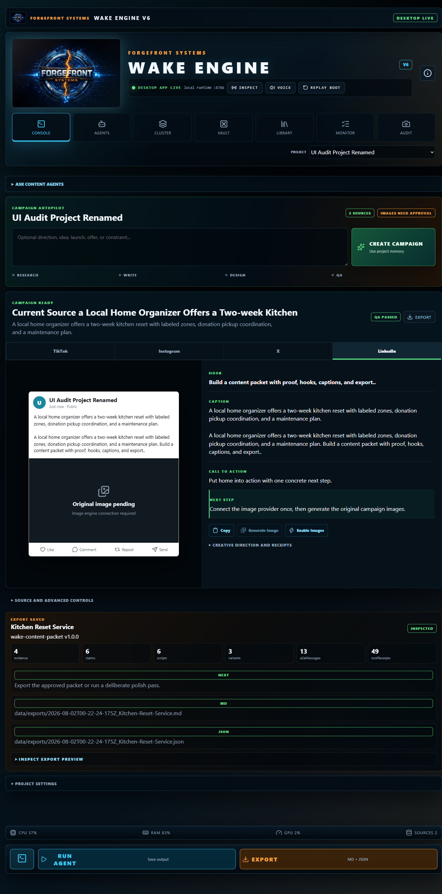

<div align="center">
  <h1>WAKE Engine V6</h1>
  <p><strong>A crash-resilient local workbench for evidence-linked content production.</strong></p>
</div>

WAKE Engine turns approved local notes, transcripts, briefs, and documents into structured content packages while preserving source provenance, blocking unsupported claims, and recording an inspectable audit trail.



## Why it is useful

Creators and small teams often have valuable source material scattered across local folders. Generic generation tools can produce copy quickly, but they may lose provenance, invent claims, require cloud uploads, and provide no reliable recovery path when a process is interrupted.

WAKE provides one local workflow:

1. Load or paste approved source material.
2. Extract evidence and citations.
3. Build strategy, scripts, hooks, captions, platform variants, and visual direction.
4. Map generated claims back to source evidence.
5. Block unsupported claims at the QA gate.
6. Place scheduled output into human review or export Markdown and JSON.
7. Preserve receipts, history, snapshots, and durable local state.

## What is implemented

| Capability | Current behavior | Verification |
|---|---|---|
| Local source intake | Reads pasted source and approved local folders | Console, Vault, `/api/sources`, `/api/frame` |
| Deterministic agent workflow | Archivist → Strategist → Scriptwriter → Creative Director → QA → Export | `npm run audit:runtime` |
| Evidence-linked claims | Maps script claims to extracted source evidence and blocks unsupported wording | Tier Zero QA packet |
| Scheduled processing | Runs enabled or manually forced folder workflows and skips unchanged source hashes | `npm run audit:scheduler` |
| Human review | Stores completed scheduled packets in a review queue | Automations page |
| Local export | Writes readable Markdown plus the complete JSON packet | Scheduler export audit |
| Durable state | Atomic writes, write-ahead logging, replay, rollback, and backup bundles | `npm run audit:phase9` |
| Local security | Loopback API, session and CSRF checks, Electron `safeStorage` credential vault | Phase 9 evidence |
| Windows desktop application | Electron application and NSIS installer configuration | `npm run package:installer` |

## Quick start

### Requirements

- Windows 10 or Windows 11
- Node.js 20 or newer
- npm
- Optional: Ollama for interactive local-model enhancement

### Run from source

```powershell
git clone https://github.com/justinevans4040-cloud/wake-engine-v6-private.git
cd wake-engine-v6-private
npm install
npm run build
npm run desktop
```

WAKE must be run from a local, non-cloud-synchronized checkout. The workspace guard rejects OneDrive, Dropbox, Google Drive, and iCloud paths but no longer depends on a developer-specific folder.

### Build the Windows installer

```powershell
npm run package:installer
```

The installer output is written under `release/`.

## Product workflow

### Console

Paste a brief, transcript, note, or task. Save it and generate the structured source frame.

### Agents

Run the deterministic six-stage content workflow. The output includes evidence, citations, strategy, scripts, platform variants, visual prompts, tool receipts, memory receipts, agent handoffs, and QA results.

### Cluster

Review the complete campaign packet and its output lanes.

### Vault and Library

Load approved local material, recover prior work, and inspect exports and history.

### Instructions

Ask how to complete an operation using only features that currently exist in WAKE. When a configured local Ollama model is unavailable, WAKE returns a deterministic runbook rather than inventing a capability.

### Automations

Configure a source folder, schedule, timezone, operator instruction, approval mode, and export directory.

The scheduler:

- Checks once per minute.
- Supports standard five-field cron expressions, including lists, ranges, and steps.
- Processes `.txt`, `.md`, and `.json` source files.
- Hashes the combined source and skips unchanged scheduled runs.
- Reuses manual queued run records instead of creating duplicates.
- Sends `Review Required` output to the review queue.
- Writes both Markdown and JSON for automatic export.
- Records failures and completion receipts in history.

Scheduled execution currently uses the deterministic Tier Zero workflow. It does not claim that the optional Ollama enhancement runs inside the scheduler.

### Monitor and Audit

Inspect runtime truth labels, tasks, system state, snapshots, and durability receipts.

## Verification

Run the portable checks:

```powershell
npm run build
npm run audit:runtime
npm run audit:scheduler
```

Run the Windows/local durability checks:

```powershell
npm run smoke
npm run benchmark
npm run gate
npm run audit:wal
npm run audit:phase9
npm run audit:ui
```

GitHub Actions runs the portable build, runtime-contract audit, and scheduler audit on pushes and pull requests.

## Proof already in the repository

- `evidence/phase-audit/phase-09-durability-security/phase9-verdict.json`
- `docs/current/PHASE_9_LOCAL_DURABILITY_SECURITY.md`
- `docs/current/TIER_ZERO_BUILD_STATUS.md`
- `docs/current/WAKE_ENGINE_MAP.md`
- `docs/wake-engine/wake_engine_manual.md`
- `archive/iterations/`

The Phase 9 evidence includes atomic storage, crash recovery, backup and restore, package-data exclusion, credential handling, loopback binding, authentication, and CSRF checks. Historical evidence is retained separately from current product claims.

## Accurate capability boundaries

- The content-agent workflow is deterministic and auditable. It should not be described as six independent language models.
- Ollama enhancement is optional and availability-dependent.
- Automatic social publishing is not implemented.
- Supported scheduled source files are currently `.txt`, `.md`, and `.json`.
- WAKE is local-first, but installing dependencies initially requires access to npm unless dependencies are already cached.
- Recovery testing proves the documented interruption cases; it is not a claim that data loss is impossible under every hardware failure.
- Human review remains the recommended approval mode for externally published content.

## Proof of Usefulness demonstration

A judge can evaluate WAKE with one ordinary source folder:

1. Add a short business or creator brief.
2. Run the workflow.
3. Inspect evidence and citation maps.
4. Review scripts and platform variants.
5. Confirm unsupported claims are blocked.
6. Send the packet to review.
7. Export Markdown and JSON.
8. Inspect the audit receipt.
9. Run the same unchanged source again and confirm it is skipped.

Useful measurements include source files processed, evidence passages extracted, claims reviewed, unsupported claims blocked, tool receipts recorded, export artifacts created, execution time, and recovery-test results.

## Architecture

- React 18 and Vite 6 interface
- Electron 43 Windows desktop runtime
- Express loopback server
- Deterministic Tier Zero content workflow
- Optional local Ollama enhancement
- Atomic JSON state with write-ahead logging
- Electron `safeStorage` provider credential vault
- Markdown and JSON exports

## License

All rights reserved by ForgeFront Systems.
