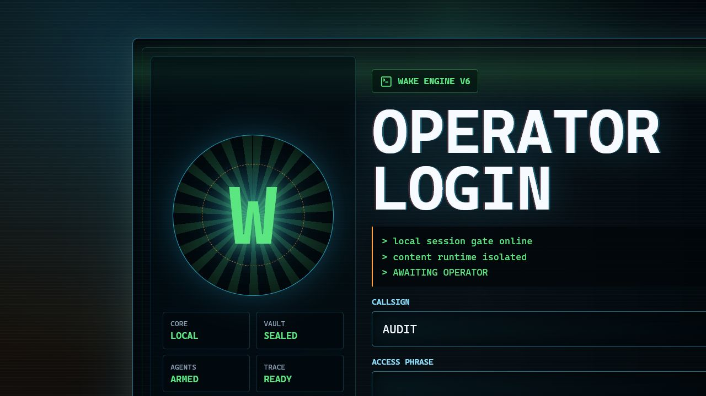
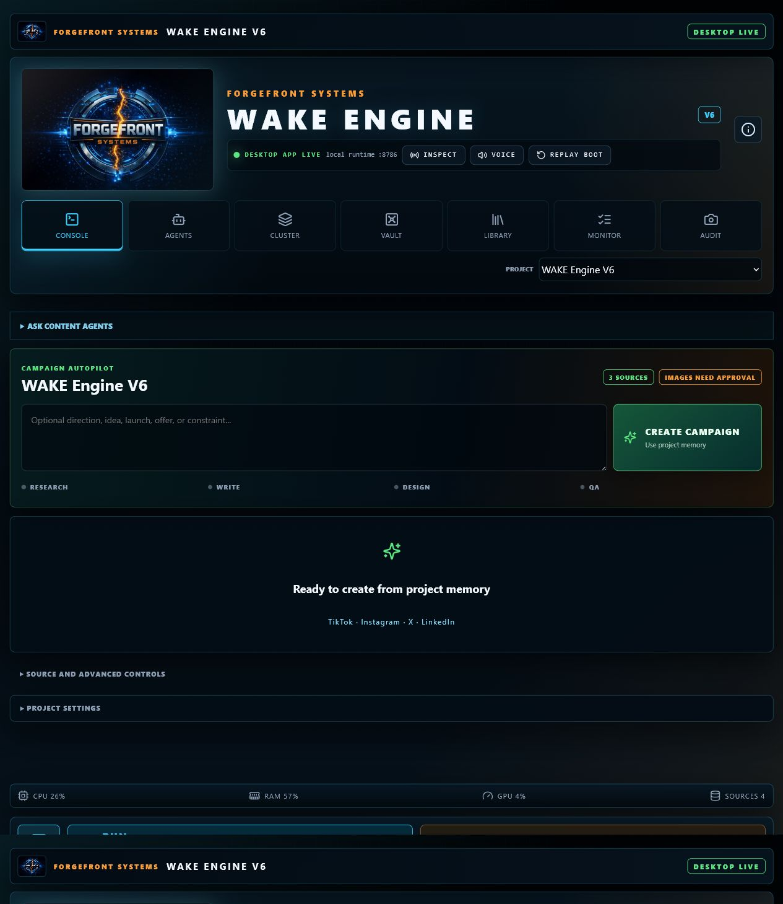
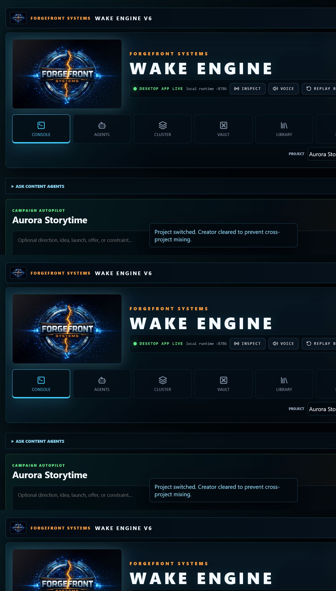
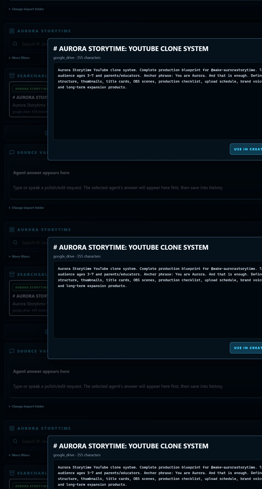
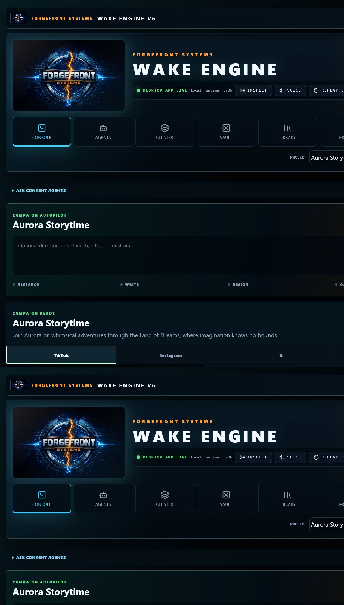
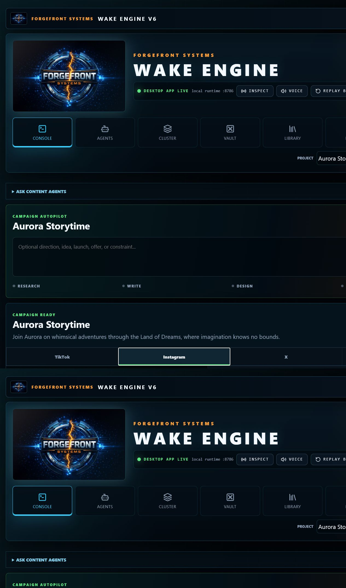
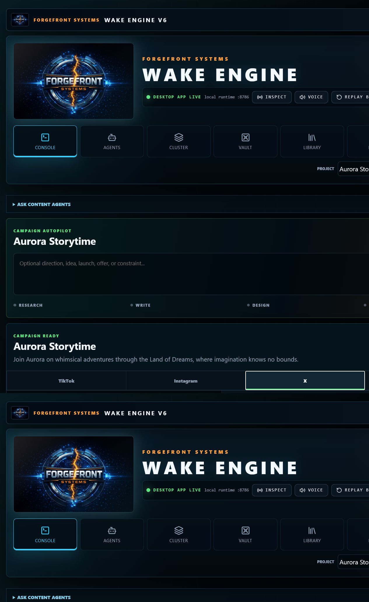
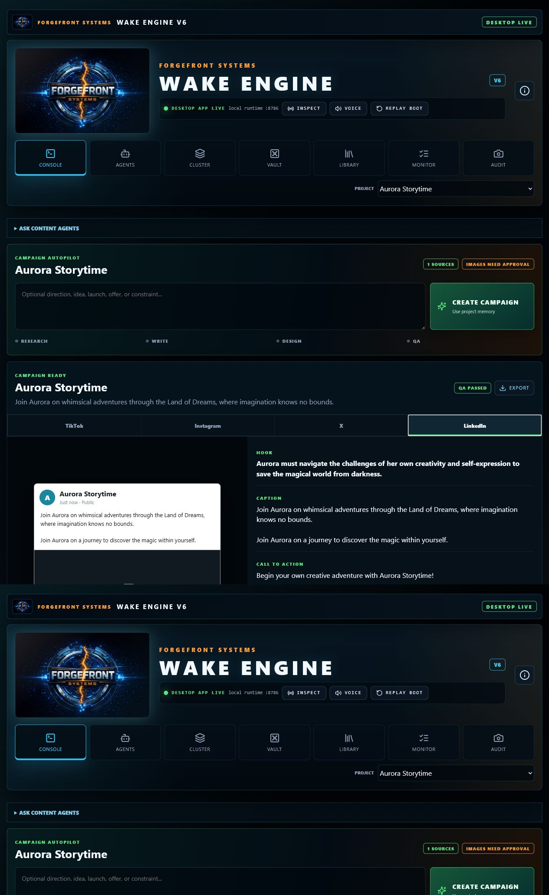
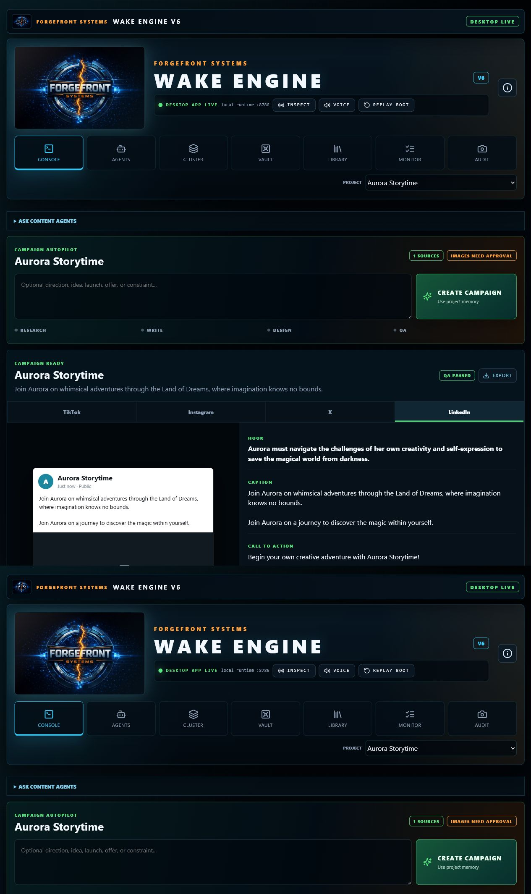
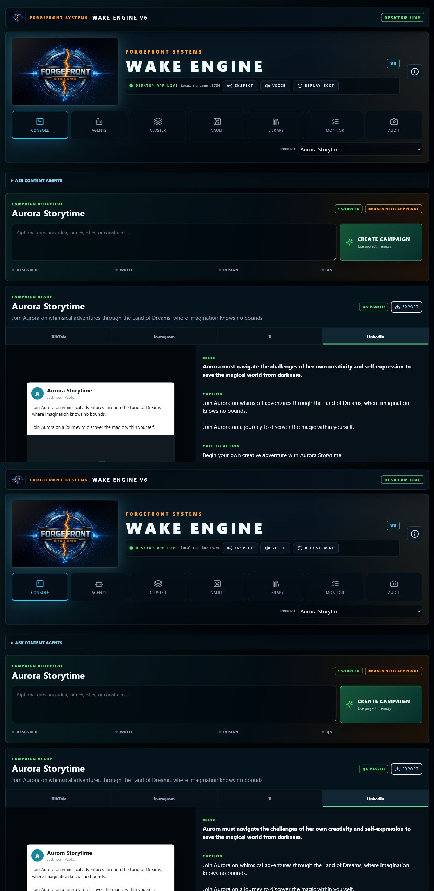

# Phase 8 Product Design Baseline

Captured from the current Wake Engine build with Product Design Audit, the Codex in-app Browser, and Computer Use. These are current-state references, not approval of the post-login clutter.

## 1. Operator Login

- Approved and locked. Preserve its composition, typography, controls, diagnostics, and old-school terminal character.
- Accessibility risk: access phrase is not masked and the current gate is presentation-only. Security repair must preserve the visual.

## 2. Current Workspace

- Campaign Autopilot exists and is functional, but oversized branding and navigation consume most of the first viewport.
- ForgeFront branding dominates the Wake Engine workspace and technical status competes with content creation.

## 3. Aurora Creation

- The finished campaign is source-driven, correctly named Aurora Storytime, QA-passed, and exposes four platform previews.
- Image generation is honestly blocked until a provider is enabled.

## 4. Source Document

- Selecting a source opens its extracted document content, not merely a filesystem or Drive path.
- The viewer needs richer page/search/navigation behavior in the later ingestion phase.

## 5. Platform Previews

- Platform switching works and changes the native preview composition.
- Original media remains unavailable until the real image-provider flow is completed.

## 6. Settings And Export

- Project settings are present but buried below the primary workflow.
- Export produces inspected Markdown and JSON with visible evidence, claim, script, variant, A2A, and tool receipt counts.

## Evidence Limits

- Screenshot evidence does not prove full accessibility compliance, security, installation behavior, or provider quality.
- Those remain explicit later-phase gates and are not silently passed by this baseline.
